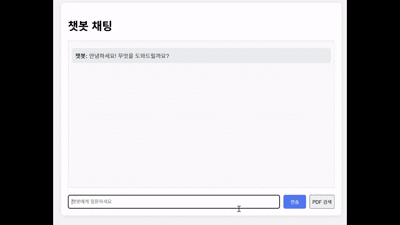
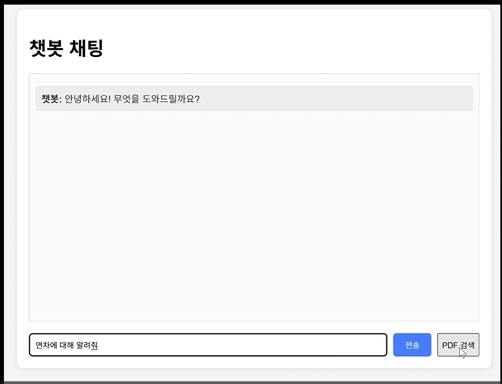
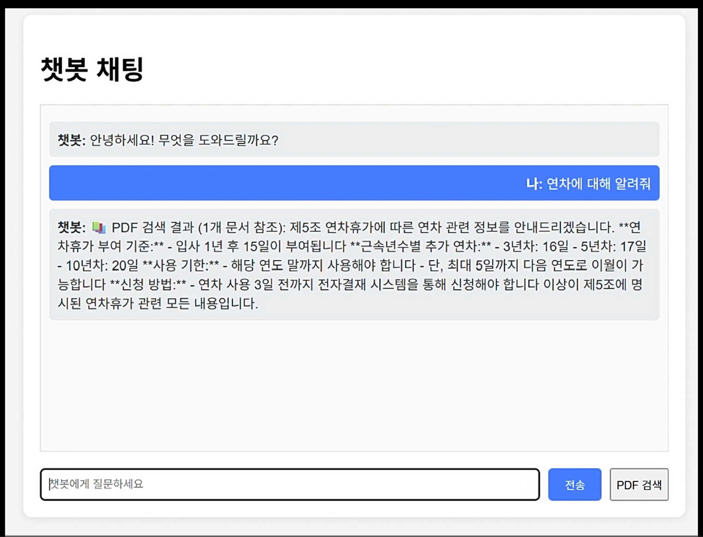

# My LLM Chatbot Portfolio

LLM 기반 챗봇 프로젝트입니다.

## 기술 스택
- Python
- Anthropic Claude API
- FastAPI
- AWS OpensearchServerless

## 목표
- RAG 기반 챗봇 구현
- 포트폴리오용 프로젝트 완성

## RAG 시스템 코드 상세 분석
🎯 전체 시스템 구조
작동 흐름:
사용자가 자연어로 질문 → 키워드 추출 → 문서 검색 → AI 답변 생성

📋 1.extract_keywords() 함수

def extract_keywords(query):
    """자연어 질문에서 핵심 키워드 추출"""

🔍 목적
사용자의 자연어 질문에서 검색에 유용한 핵심 키워드만 추출

📝 상세 동작
1-1. 키워드 사전 정의
pythonpolicy_keywords = [
    "연차", "월차", "휴가", "병가", "경조사", 
    "급여", "상여금", "보너스", "월급",
    # ... 
]

미리 정의된 정책 관련 키워드들
다양한 단어 카테고리로 분류

1-2. 키워드 매칭
found_keywords = []
query_lower = query.lower()

for keyword in policy_keywords:
    if keyword in query_lower:
        found_keywords.append(keyword)

질문을 소문자로 변환 (대소문자 구분 없이 검색)
한국어는 대소문자가 없기에 필요가 없다다.
각 키워드가 질문에 포함되어 있는지 확인
찾은 키워드들을 리스트에 저장

1-3. 결과 반환
if found_keywords:
    return " ".join(found_keywords)  # 키워드들을 공백으로 연결
else:
    # 조사, 어미 제거
    cleaned = query.replace("은", "").replace("는", "")...
    return cleaned
예시:

입력: "연차는 몇 일까지 사용할 수 있나요?"
출력: "연차" (키워드 발견)
입력: "회사 주차장은 어디인가요?"
출력: "회사 주차장 어디인가" (키워드 없어서 정제)

🔍 2. rag_chat() 함수 - 메인 엔드포인트
2-1. 키워드 추출 단계

original_query = request.message
search_query = extract_keywords(original_query)

사용자의 원본 질문 저장
extract_keywords()로 검색용 키워드 추출

2-2. OpenSearch 검색 쿼리 구성

🎯 전체 구조 이해
{
  "query": { ... },      // 어떻게 검색할지
  "size": 3,            // 몇 개 결과 가져올지
  "_source": [...]      // 결과에서 어떤 필드만 가져올지
}

🔍 1. bool 쿼리 - 여러 조건 조합
"query": {
  "bool": {
    "should": [...],           // OR 조건 (이 중 하나라도 맞으면 됨)
    "minimum_should_match": 1  // 최소 1개는 맞아야 함
  }
}

should의 의미:

must: 반드시 만족해야 함 (AND)
should: 만족하면 좋음 (OR)
must_not: 만족하면 안됨 (NOT)

우리 코드에서는 should 사용 → 4가지 방법 중 하나라도 매칭되면 결과에 포함

🎯 2. 4가지 검색 방법 상세 분석
2-1. match_phrase (완전 구문 매칭) - 점수 3.0점
json{
  "match_phrase": {
    "content": {
      "query": search_query,
      "boost": 3.0
    }
  }
}
예시:

검색어: "연차 휴가"
매칭: "연차 휴가는 15일입니다" ✅
불매칭: "연차는 좋고 휴가는 나쁩니다" ❌

특징: 단어들이 정확히 붙어서 나와야 함
2-2. match (부분 매칭) - 점수 2.0점
json{
  "match": {
    "content": {
      "query": search_query,
      "boost": 2.0
    }
  }
}
예시:

검색어: "연차 휴가"
매칭: "연차는 좋고 휴가는 나쁩니다" ✅
매칭: "휴가 중에 연차를 사용합니다" ✅

특징: 단어들이 떨어져 있어도 둘 다 있으면 매칭
2-3. wildcard (와일드카드) - 점수 1.0점
json{
  "wildcard": {
    "content": "*연차*"
  }
}
예시:

검색어: "연차"
매칭: "특별연차제도" ✅
매칭: "임시연차규정" ✅

특징: 단어 앞뒤에 뭐가 붙어도 매칭
2-4. multi_match (유연한 매칭) - 점수 1.5점
json{
  "multi_match": {
    "query": search_query,
    "fields": ["content"],
    "type": "cross_fields",
    "operator": "or",
    "boost": 1.5
  }
}

파라미터 설명:
fields: 어떤 필드에서 검색할지
type: "cross_fields": 여러 필드를 하나처럼 취급
operator: "or": 단어 중 하나라도 맞으면 됨

📊 3. 점수(boost) 시스템
match_phrase: 3.0점 (가장 정확한 매칭)
    ↓
match: 2.0점 (단어들이 모두 있음)
    ↓  
multi_match: 1.5점 (유연한 매칭)
    ↓
wildcard: 1.0점 (부분 매칭)

🎯 4. 기타 설정들
4-1. size: 3
json"size": 3

검색 결과를 상위 3개만 가져옴
너무 많은 결과는 AI가 처리하기 어려움

4-2. _source 필드 제한
json"_source": ["content", "filename", "chunk_id", "chapter", "article"]

전체 데이터가 아닌 필요한 필드만 가져옴
네트워크 트래픽 절약

4-3. minimum_should_match: 1
json"minimum_should_match": 1

should 조건 중 최소 1개는 만족해야 함
모든 조건이 실패하면 결과 없음

OpenSearch 검색 결과 처리 과정 🔍
1️⃣ 검색 실행
search_response = opensearch_client.search(
    index="pdf-documents",    # 어떤 인덱스에서 검색할지
    body=search_body          # 앞서 만든 검색 쿼리
)

실제로 일어나는 일:
1.OpenSearch 서버에 검색 요청 전송
2.서버가 "pdf-documents" 인덱스에서 검색
3.4가지 매칭 방법으로 관련 문서 찾기
4.점수 순으로 정렬해서 상위 3개 결과 반환

2️⃣ 검색 결과 구조 이해
OpenSearch가 반환하는 search_response는 이런 구조입니다:
{
  "hits": {
    "total": { "value": 5 },  // 전체 매칭된 문서 수
    "hits": [                 // 실제 결과 배열 (최대 3개)
      {
        "_score": 4.2,        // 관련성 점수
        "_source": {          // 실제 문서 내용
          "content": "연차 휴가는 15일입니다...",
          "filename": "인사규정.pdf",
          "chunk_id": 5,
          "chapter": "제2장",
          "article": "제5조"
        }
      },
      {
        "_score": 3.1,
        "_source": {
          "content": "월차 사용 규정...",
          "filename": "인사규정.pdf", 
          "chunk_id": 6,
          "chapter": "제2장",
          "article": "제6조"
        }
      }
    ]
  }
}

3️⃣ 결과 개수 확인
print(f"검색 결과 개수: {len(search_response['hits']['hits'])}")
🎯 여기서 체크하는 것:

search_response['hits']['hits'] = 실제 검색 결과 배열
len(...) = 배열의 길이 = 찾은 문서 개수
최대 3개 (size=3으로 설정했으니까)

출력 예시:
검색 결과 개수: 2

4️⃣ 결과를 사용하기 쉬운 형태로 변환
candidates = []
for hit in search_response['hits']['hits']:
    source = hit['_source']
    candidates.append({
        "content": source['content'],
        "filename": source.get('filename', 'Unknown'),
        "chunk_id": source.get('chunk_id', 0),
        "chapter": source.get('chapter', 'N/A'),
        "article": source.get('article', 'N/A'),
        "score": hit['_score']
    })
🔄 변환 과정:
변환 전 (OpenSearch 원본):
{
  "_score": 4.2,
  "_source": {
    "content": "연차 휴가는...",
    "filename": "인사규정.pdf"
  }
}
변환 후 (우리 형태):
python{
  "content": "연차 휴가는...",
  "filename": "인사규정.pdf", 
  "chunk_id": 5,
  "chapter": "제2장",
  "article": "제5조",
  "score": 4.2
}

🎯 전체 흐름 요약
 검색 실행 → 2. 결과 확인 → 3. 데이터 정리 → 4. 빈 결과 체크 → 5. AI용 컨텍스트 생성
    ↓              ↓              ↓              ↓                ↓
OpenSearch      몇 개 찾았나?    사용하기 쉽게    없으면 에러      AI가 이해하기 쉽게
서버 호출        체크            변환            반환             포맷팅

